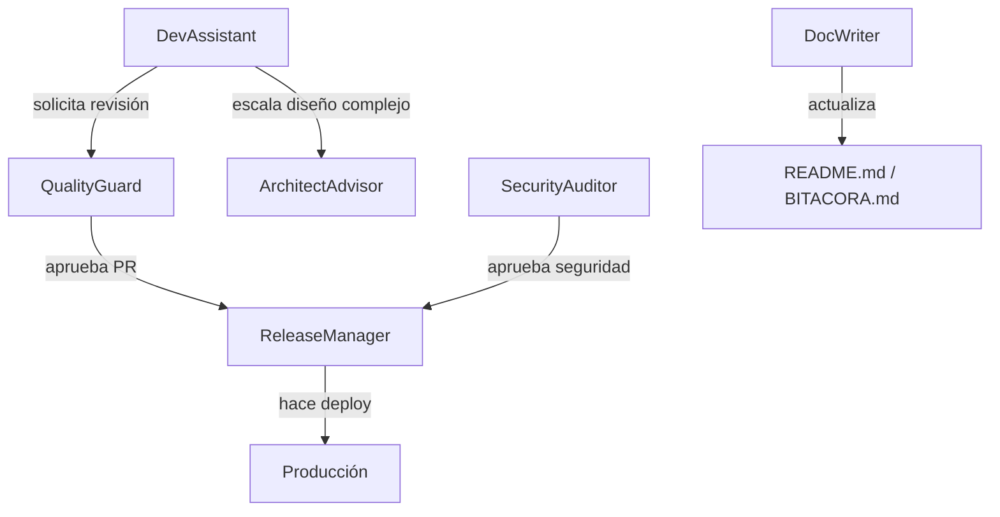

# Agents — humanizer-backend

> Configuración de agentes **específica** para el servicio `humanizer-backend`.
> Extiende y especializa las definiciones globales de [`/agents.md`](../agents.md).

---

## Contexto del servicio

| Propiedad      | Valor                                         |
|----------------|-----------------------------------------------|
| Lenguaje       | Python 3.11                                   |
| Framework      | FastAPI 0.95.2 + Uvicorn                      |
| Schema         | Pydantic v1                                   |
| LLM Provider   | Groq (`llama-3.1-70b-versatile`)             |
| Rate Limiting  | InMemory (dev) / Redis (prod)                 |
| Logging        | `structlog` (JSON estructurado)               |
| Métricas       | `prometheus_client`                           |
| CI             | GitHub Actions (`.github/workflows/ci.yml`)   |
| Contenedor     | Docker (`python:3.11-slim`)                   |

---

## Agente primario: DevAssistant (humanizer scope)

Este agente es el punto de entrada para cualquier tarea de desarrollo en este servicio.

### Módulos que conoce

| Módulo                   | Responsabilidad                              |
|--------------------------|----------------------------------------------|
| `app/main.py`            | Endpoints FastAPI, middlewares, router       |
| `app/logic.py`           | Orquestación del flujo de humanización       |
| `app/schemas.py`         | Contratos Pydantic (input/output)            |
| `app/groq_client.py`     | Cliente HTTP hacia Groq con retry/fallback   |
| `app/rules.py`           | Motor de reglas locales sin IA               |
| `app/prompts.py`         | Prompts por tono (`PROMPTS_POR_TONO`)        |
| `app/config.py`          | Variables de entorno centralizadas           |
| `app/rate_limiter.py`    | Rate limiter in-memory                       |
| `app/redis_rate_limiter.py` | Rate limiter Redis-backed               |
| `app/middleware.py`      | `LoggingMiddleware` (structlog)              |
| `app/utils.py`           | Sanitización, diff, request_id               |
| `app/data/`              | Archivos de reglas (`*.txt`)                 |

### Flujo de un request `/api/v1/humanize`

```
Request (TextoInput)
  ↓ LoggingMiddleware (request_id)
  ↓ RateLimiter middleware
  ↓ humanize_endpoint()
    ↓ _build_humanize_response()
      ↓ procesar_humanizacion()
        ↓ sanitizar_texto()
        ↓ generar_prompt_sistema(tono)
        ↓ call_groq_completion()   ← Groq API | simulated fallback
        ↓ aplicar_reglas_basicas() ← si apply_rules=True
        ↓ calcular_metricas_texto()
  ↓ HumanizerResponse (JSON)
```

### Variables de entorno requeridas

| Variable              | Obligatoria | Default              | Descripción                    |
|-----------------------|-------------|----------------------|--------------------------------|
| `GROQ_API_KEY`        | No          | *(modo simulado)*    | API key de Groq                |
| `GROQ_API_URL`        | No          | *(modo simulado)*    | URL del endpoint Groq          |
| `ENV`                 | No          | `development`        | Entorno (`development`/`production`) |
| `REDIS_URL`           | No          | *(in-memory limiter)*| Redis para rate limiting       |
| `RATE_LIMIT_REQUESTS` | No          | `60`                 | Requests por ventana           |
| `RATE_LIMIT_WINDOW`   | No          | `60`                 | Ventana en segundos            |
| `LOG_LEVEL`           | No          | `INFO`               | Nivel de log                   |
| `ALLOWED_ORIGINS`     | No          | `http://localhost:3000` | CORS (separado por `;`)    |
| `REQUEST_SIZE_LIMIT`  | No          | `1048576` (1 MB)     | Tamaño máximo de request       |

### Tareas prioritarias (del BITACORA.md)

- [ ] Migrar `httpx.Client` síncrono → `httpx.AsyncClient` en `groq_client.py`.
- [ ] Añadir autenticación por API Key (middleware o `Depends`).
- [ ] Implementar caché Redis para requests idénticos.
- [ ] Multi-stage `Dockerfile` con usuario no-root.
- [ ] Exponer `/metrics` con `prometheus_client` para Prometheus/Grafana.
- [ ] Añadir tests de reglas locales y `rules_probability`/`rules_seed`.
- [ ] Reemplazar `InMemoryRateLimiter` en producción con `RedisRateLimiter`.

---

## Agente de apoyo: QualityGuard (humanizer scope)

Ejecuta antes de cada PR. Comandos válidos en este servicio:

```bash
# Desde humanizer-backend/
make test           # pytest -q
make lint           # ruff o flake8
pytest --cov=app --cov-report=term-missing --cov-fail-under=80
```

---

## Agente de apoyo: SecurityAuditor (humanizer scope)

Checklist específico para este servicio:

- [ ] `GROQ_API_KEY` no está en `.env` commiteado ni en logs.
- [ ] Endpoint `/api/v1/admin/reload-rules` devuelve 404 cuando `ENV=production`.
- [ ] CORS no usa `*` en `ALLOWED_ORIGINS`.
- [ ] Rate limiter activo y testeado (ver `tests/test_rate_limiter.py`).
- [ ] `pip-audit -r requirements.txt` sin CVEs críticos.

---

## Cómo interactúan los agentes en este servicio



---

*Última actualización: 2026-02-19 | Servicio: humanizer-backend*
